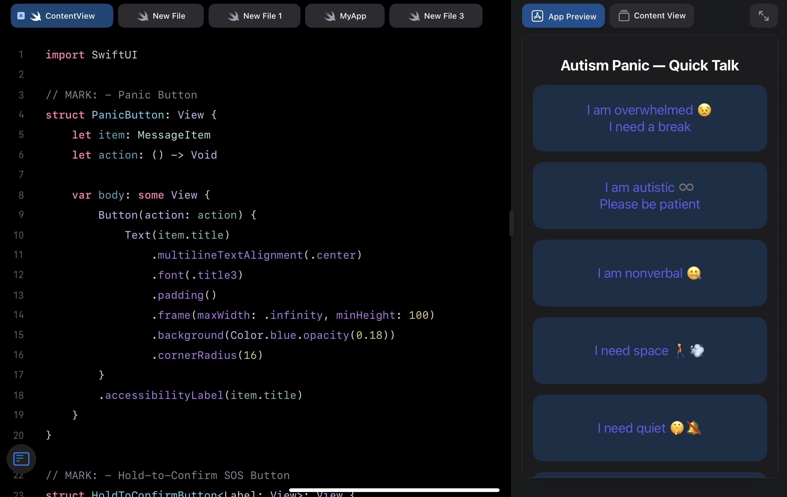
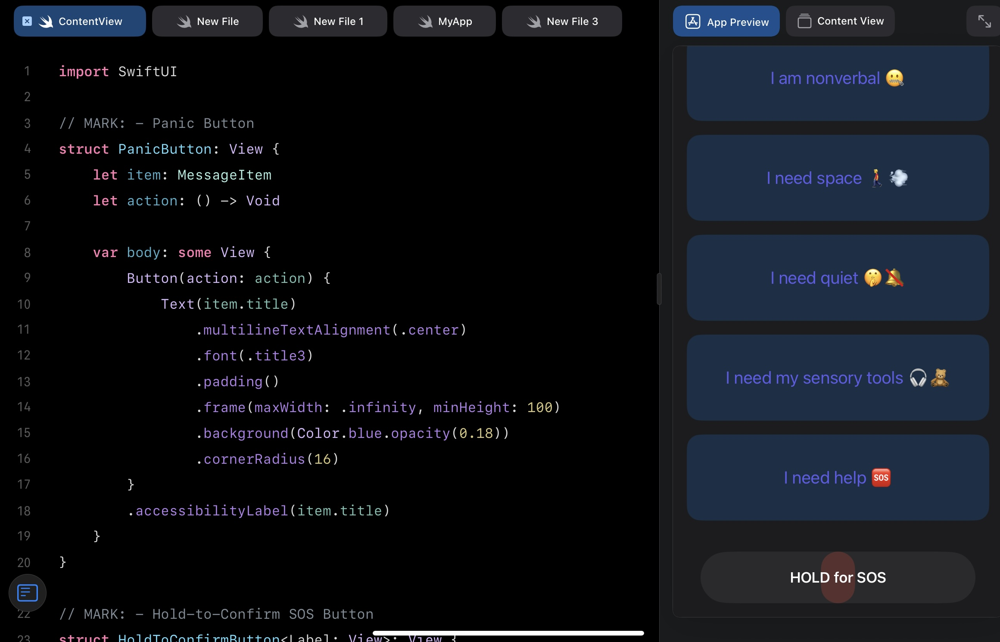

# Autism Emergency App

Autism Emergency App is a simple app designed to help autistic and nonverbal individuals communicate urgent needs quickly and clearly.  
It shows easy-to-tap messages like “I am overwhelmed” or “I need space” to alert caregivers, family, or staff.

---

## 📱 Screenshots

### Main Screen

### SOS Button

---

## ✨ Features
- **Quick Alerts**: Tap messages like “I am overwhelmed,” “I need space,” or “I need help.”  
- **Custom Messages**: Add your own personalized messages.  
- **Visual & Text Alerts**: Makes sure your need is clear even if you are nonverbal.  
- **Large Buttons**: Designed for easy use and accessibility.
- **Works Offline**: No internet connection needed.
    
